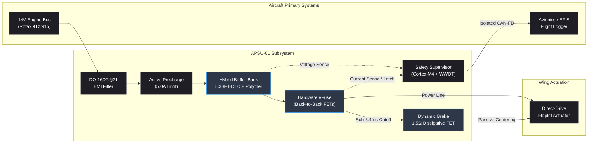

# APSU-01: Aero-Power & Safety Unit
### Subsystem for Fast Power Buffering, Bus Stabilization and Fail-Neutral Actuation in Active Gust Mitigation Systems

---

## Overview

Active gust alleviation systems on light aircraft—such as feedforward flaplet control tested on the Shark 600—rely on fast aerodynamic surfaces running at frequencies between 20 Hz and 30 Hz.

Driving direct-drive actuators continuously against aerodynamic load creates two specific electrical challenges on standard 14V light-aircraft buses (Rotax 912/914/915 engines with 250W–450W generator setups):

* **Transient Bus Instability:** Demanding 25A current pulses at 25 Hz causes voltage sags on the primary 14V line, risking undervoltage resets on critical avionics (EFIS, transponder, radio).
* **Asymmetric Hardover Risk:** An actuator bridge failure or mechanical jam at full deflection induces an abrupt roll asymmetry. Traditional thermal breakers or slow aircraft fuses take hundreds of milliseconds to disconnect, which is too slow for safe upset recovery.

APSU-01 is a dedicated power buffer and safety interface placed between the aircraft 14V bus and the wing actuator. It isolates dynamic current pulses from the generator, provides ultra-fast analog hardware cutoff on faults, and passively centers the control surface.

---

## Architecture



---

## Verification & Engineering Metrics

All parameters below were calculated and verified across SPICE circuit simulations (LTspice/QSPICE) and cycle-accurate virtual HIL emulation (Renode + Python):

| Parameter | Design Target | Simulated / Modeled Value | Validation Source |
|---|---|---|---|
| **Subsystem Mass** | < 450 g | 385 g (estimated) | CAD + Component BOM budget |
| **Generator Current Draw** | ≤ 6.0 A continuous | 5.18 A continuous | SPICE transient analysis |
| **14V Bus Voltage Ripple** | < ±0.50 V | ±0.13 V | Under 25A / 25Hz burst load |
| **Output Drop during 3s Burst** | < 1.50 V | 1.18 V (13.8V down to 12.62V) | Transient load simulation |
| **Instantaneous Switching Drop**| < 0.10 V | 0.075 V | Solid polymer / MLCC low-ESR bank |
| **Hardware eFuse Cutoff** | < 15.0 µs | 3.35 µs | Analog comparator + hardware latch |
| **Software Fault Detection** | < 5.0 ms | 2.14 ms | Cortex-M4 1 kHz deterministic FSM |
| **VHF Band EMI Attenuation** | > 60 dB (118–137 MHz) | > 65 dB | AC analysis (ideal termination) |
| **Passive Flaplet Centering** | < 100 ms | 65 ms | Aero-mechanical model (1.5 Ω) |

---

## Technical Details

### 1. Hybrid Energy Storage
* **Long-pulse branch:** 6x 50F / 2.7V EDLC supercapacitors in series ($C_{\text{eq}} \approx 8.33\text{ F}$, nominal string rating 16.2V) with active resistor-bypass cell balancing.
* **Fast-transient branch:** 4000 µF solid aluminum-polymer bank ($ESR \approx 2\text{ m}\Omega$) in parallel with X7R MLCC capacitors, absorbing steep 25 Hz edges with negligible ohmic drop.
* **Controlled charging:** Closed-loop linear precharge limiting bus draw to 5.0A (~22.5 s from 0V to 13.5V) with actuation interlock until ready. Back-to-back FETs block reverse current during engine-crank bus sags ($V_{\text{bus}} < 9\text{ V}$).

### 2. Sensing, eFuse & Passive Brake
* **Current Sensing:** 2 mΩ 4-terminal Kelvin shunt (Vishay WSLP2512) paired with a high-bandwidth current-sense amplifier (TI INA240).
* **Analog Cutoff:** Sub-50ns comparator (Microchip MCP6561) tripping an SR latch when $I_{\text{load}} > 40\text{ A}$. The latch directly pulls down the MOSFET gate driver in 3.35 µs, bypassing MCU latency entirely.
* **Fail-Neutral Path:** Once the main line opens, a delayed grounding FET connects a 1.5 Ω (10W D2PAK) dynamic brake resistor across the actuator leads. The back-EMF generated by aerodynamic surface realignment dampens the flaplet back to zero without uncontrolled flutter.

### 3. Avionics Compatibility & Firmware
* **DO-160G Section 21 Filter:** Dual-stage $\pi$-filter with nanocrystalline common-mode choke and differential inductors, suppressing actuator PWM switching noise in the aeronautical VHF band (118–137 MHz).
* **Firmware:** Bare-metal C targeting an STM32G431 (Cortex-M4). Uses a deterministic 1 kHz SysTick loop, 3-channel circular DMA sampling, and zero heap allocation (`malloc`/`free` omitted).
* **Watchdog Supervision:** External windowed hardware watchdog (TI TPS3851) requiring execution strictly within an 800–1200 µs window.
* **Telemetry:** Galvanically isolated CAN-FD transceiver ($2.5\text{ kV}_{\text{RMS}}$, TI ISO1042) broadcasting subsystem health at 100 Hz.

---

## Directory Layout

```text
├── docs/
│   ├── APSU-01_Technical_Dossier.md
│   └── figures/
├── hw/
│   ├── kicad/
│   └── sim/
│       ├── apsu_sim.cir
│       └── waveforms_fault.png
├── fw/
│   ├── Makefile
│   ├── linker/
│   └── src/
└── test/
    ├── apsu_target.repl
    ├── apsu_sim.resc
    └── hil_test_runner.py
```

---

## Building and Testing

### Compile the Bare-Metal Firmware
```bash
cd fw
make clean && make
```

### Run SPICE Simulation
Open `hw/sim/apsu_sim.cir` in LTspice or QSPICE to run the 2.0s transient test with injected load short-circuit:
```bash
XVIIx64.exe -b hw/sim/apsu_sim.cir
```

### Virtual HIL Co-Simulation
Run the Renode virtual board and execute the automated Python fault-injection harness:
```bash
# Terminal 1: Launch virtual MCU
renode test/apsu_sim.resc

# Terminal 2: Run test suite
python3 test/hil_test_runner.py
```

---

## Author

**Christian Pietrantonio**  
Electronic Engineer  
Focus: Embedded Firmware, Power Electronics & Avionics Hardware Integration
